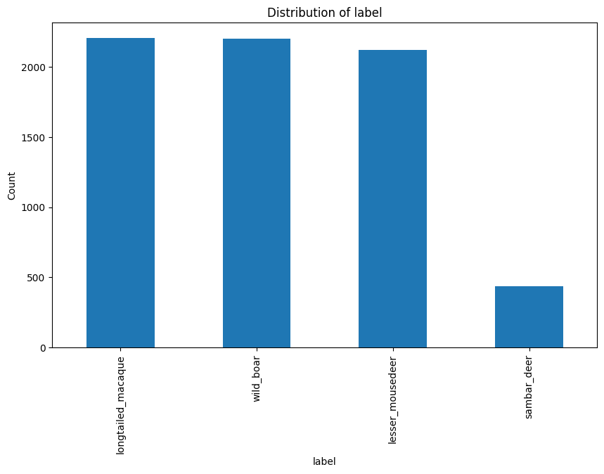

# Zero-shot Classification of Camera Trapping Footage using Reference Embedding Clusters [Part 1]

*A big thank you to my lovely teammates: Chong Yun Yu, Emma Chao, Gracia Goh, John Tan, Liam Wells Ayathan, Scormon Ho, Stanley Han, Max Khoo and Tay Li Si*

Last year for the National Parks Board of Singapore’s [Youth Stewards for Nature](https://www.nparks.gov.sg/learn/programmes/youth-stewards-nature), my friends and I worked on the AI for Camera Trapping Footage Classification project. Camera trappings are cameras used by conservationists, put onto trees to record wildlife activities. It’s triggered by motion sensors, then records about 20-30 seconds of continuous footage. Our task was to classify this footage among the four prominent animals in Singapore: **Wild Boar, Long-tailed Macaques, Lesser Mouse-deer, and Sambar Deer.**

    

        
        
    

    

        
        
    

    

    Source: Wild Boar, Long-tailed Macaques (Our Wild Neighbor), Lesser Mouse-deer (Singapore Geographic), Sambar Deer (World Land Trust)
    

## DATA EXPLORATION
Like all AI projects, we began with a deep dive into the data, first through manual inspection, then with more in-depth data exploration.

## Camera Footage of Lesser Mouse-deer and Long-tailed Macaques

    
    

Camera Footage of Lesser Mouse-deer (left) and Long-tailed Macaques (right). Courtesy of National Parks Board of Singapore.

The data range from quite easy to next-to-impossible to identify that there is even an animal. As one can see above, the captured data includes both RGB images in daylight and infrared night vision at night, producing black and white images using a flash of light from the camera. Hurdles include common challenges in computer vision like occlusion, low-light conditions, dark or hazy blobs on camera lenses due to fogging or water droplets. Another challenge is that the same species can appear very different depending on age, angle, body part, or posture (intraclass variance), while different species may look alike (interclass similarity). For example, a baby deer can closely resemble a Lesser Mouse-deer. Furthermore, there is also the issue of false triggers, when the camera is triggered by branches falling or the animal enters and exits the field of view quickly.

    

Distribution of Image Data by Species

As for the dataset as a whole, we were given a dataset of videos and frames, extracted at 4 Frames-per-second (FPS) and manually curated by the previous intern working on this project, ensuring no false trigger or erroneous label. In the image dataset, We find lower counts of sambar deer than the other 3 species. Not to worry, because A. Data imbalance will be later shown to not be a huge problem, and B. Sambar Deer, which was believed to have died off in Singapore in the 1950, [has made a comeback after some escaped from the zoo 50 years ago!](https://www.straitstimes.com/singapore/environment/sambar-deer-making-a-return-in-singapore-study-shows) 
## PREPROCESSING: A FAIR TRAIN-TEST SPLIT?
After my friend used hashing to eliminate duplicate images, we still noticed images very similar to each other, and more alarmingly, existing in both the train set and test set (splitted by the previous intern). This is due to the intern having shuffled the entire dataset before splitting the train-test. While this is technically the standard practice for image classification, for **video** classification, consecutive frames would appear in both train and test sets. So a model trained on frame `t`, will trivially perform well on frame `t+1`, captured 10ms later, and thus this would not be a fair evaluation.

We had to find a way to properly resplit the dataset. Using hashing and metadata failed to identify any clue about when and how these images were produced. Noticing the timestamp in the frames itself, I used [EasyOCR](https://github.com/JaidedAI/EasyOCR) to successfully extract the date and time of the images. After some post-processing to correct OCR misreads (e.g., '3' mistaken for '8'), we split the dataset by date, disregarding the few failure cases.

## BASELINES
As standard industry practice, I led a team to quickly train a model on our image dataset, while another team scoured the internet for publicly available models pre-trained on similar or in-domain data.

    

MobileNet's Confusion Matrix for Image Test Set

With roughly 2000 images in the test set and a MobileNetv3 trained on a train set 3.5 times that size, we achieve an F1-score of 0.72, with Sambar Deer predictably performing worst. As a next step, we also trained FasterRCNN and YOLO for animal detection, and CLIP for classification to much lower success. Also, I looked for other public datasets of all 4 species. Ashamed that all that work was for nothing, because…

The other team have already reached F1-score of 0.84 on videos. [Zamba](https://zamba.drivendata.org/)’s 2 pretrained models were trained on 250,000 of 1-minute camera trapping videos of European and African species. With the backbone of EfficientNet, their latency and size are not bad as well. Finetuning on them has shown phenomenal performance on our Singaporean dataset.

While at this point, we couldn’t compare our metrics directly, since at this point, we couldn’t even confirm all test images are only in test videos, I know we had to find another way to compete and/or improve upon the other team’s already near-perfect solution.

**To be continued...**