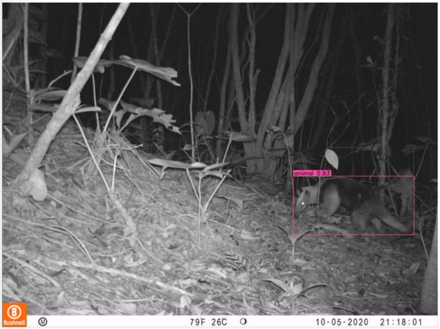
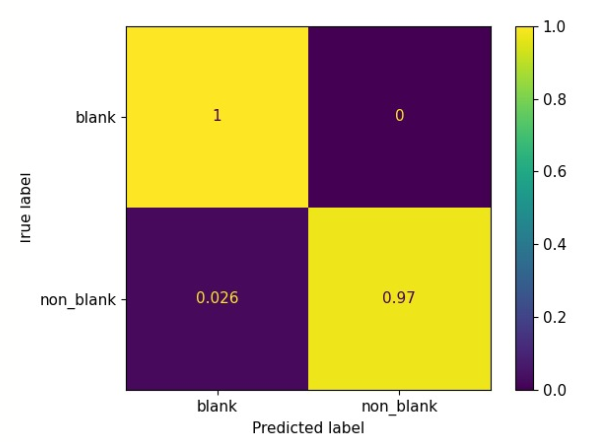
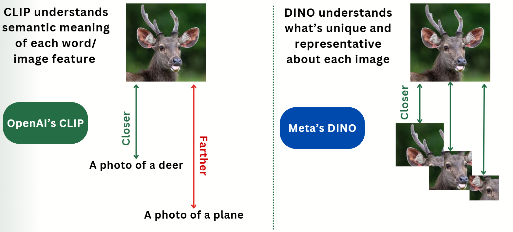
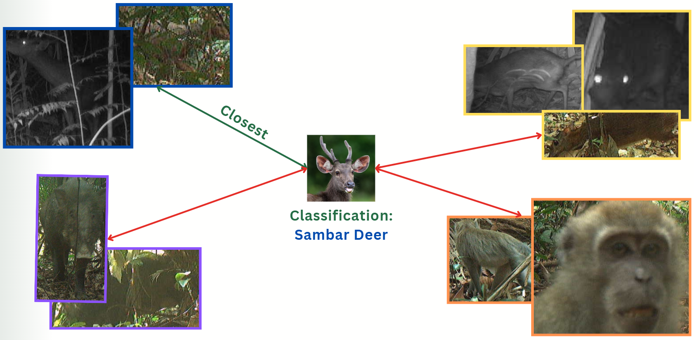
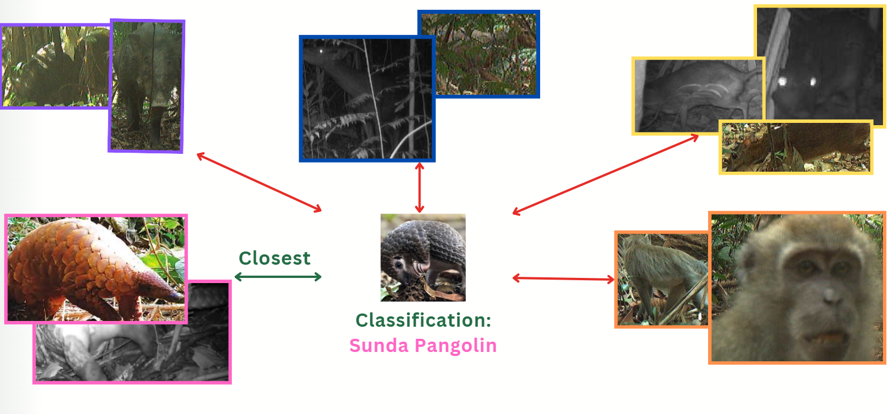
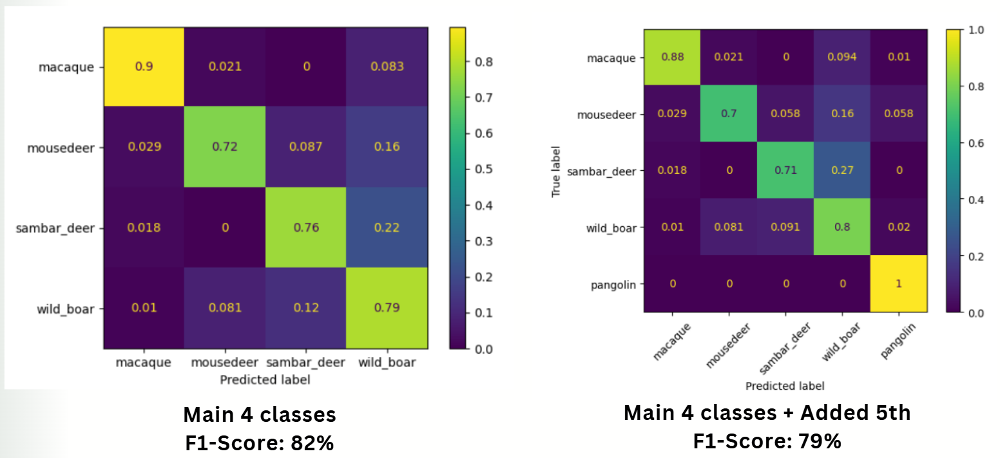
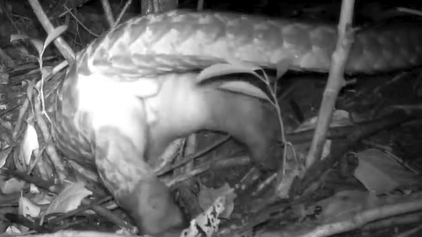
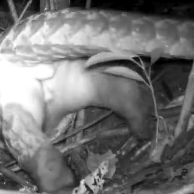
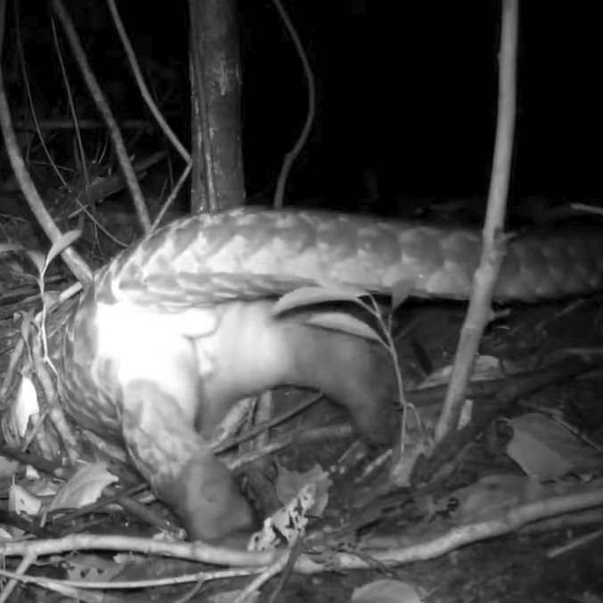
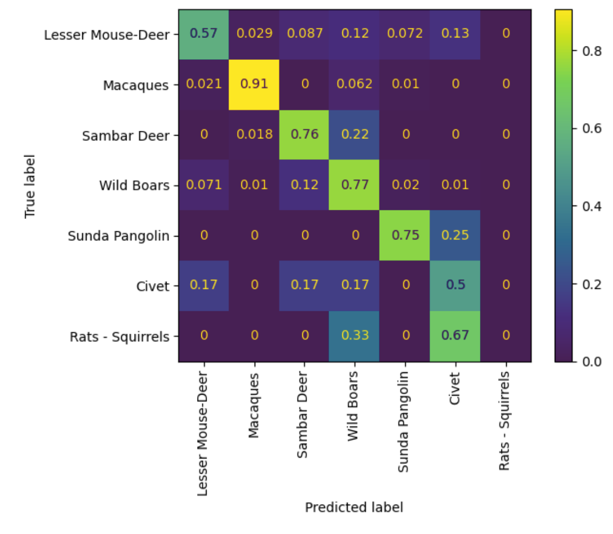

*A big thank you to my lovely teammates: Chong Yun Yu, Emma Chao, Gracia Goh, John Tan, Liam Wells Ayathan, Scormon Ho, Stanley Han, Max Khoo and Tay Li Si*

## Approach

So how can we beat a solution that is fast, light and trained on 4200 hours of in-domain data. Surely, some measly images from the internet, which also include toy pigs and cartoon deers, would not be able to compete. 

I had to re-tallied up our resources and listed numerous solutions, with my intuitive assessment of their scalability and projected performance. Here’s my notes from back then:

<table style="width: 100%; border-collapse: collapse;">
    <tr>
        <td style="border: 1px solid black; padding: 10px; vertical-align: top;">
            <h3>Resources We Have</h3>
            <ul>
                <li>GroundingDINO: Detects bounding boxes of animals in trivial images, but cannot classify them.</li>
                <li>YOLO: Can be trained on our limited bbox data but may not perform well (as demonstrated by Liam).</li>
                <li>Classification models: Can be fine-tuned for image classification.</li>
                <li>VQA model: Can answer easy questions using a single image.</li>
                <li>CLIP: Can classify images out of the box, infer text embeddings, and compare distances.</li>
                <li>SAM (Segment Anything Model)</li>
                <li>A few thousand images of animals.</li>
            </ul>
            
<em>Note: Items that need training/fine-tuning are underlined. Others are pretrained foundational models that can be used out of the box.</em>

        </td>
    </tr>
    <tr>
        <td style="border: 1px solid black; padding: 10px; vertical-align: top;">
            <h3>Empty Image Detection</h3>
            <ul>
                <li>Analyze logit output of Yes/No answers from TinyLLAVA.</li>
                <li>Use a confidence threshold to check if LLAVA is uncertain (indicating possible empty images).</li>
                <li>Rank images based on confidence of having an animal.</li>
                <li>Consider asking:
                    <ul>
                        <li>“Is the animal clearly visible?” (to check for occlusion)</li>
                        <li>“Can we clearly see the head and body of the animal?”</li>
                    </ul>
                </li>
            </ul>
        </td>
    </tr>
    <tr>
        <td style="border: 1px solid black; padding: 10px; vertical-align: top;">
            <h3>Specie Classification</h3>
            <ul>
                <li><strong>Option 1:</strong> Continue training MobileNet on existing and new data (after filtering empty images with TinyLLAVA).
                     <em>Scalable: 3 | Accuracy: 7 (requires retraining for each new species)</em>
                </li>
                <li><strong>Option 2:</strong> Improve Zamba models using augmentation tricks and analyzing failure cases.
                     <em>Scalable: 3 | Accuracy: 9 (requires retraining for each new species)</em>
                </li>
                <li><strong>Option 3:</strong> LLAVA filters out empty and hard images → GroundingDINO extracts bounding boxes (or Motion Detection, which tends to perform poorly) → (Optional) SAM confirms bounding boxes.
                    <ul>
                        <li>Train classification model on cropped images.  <em>Scalable: 3 | Accuracy: 8</em></li>
                        <li>Use CLIP embeddings to classify using text embeddings.  <em>Scalable: 6 | Accuracy: 8</em></li>
                        <li>Use CLIP embeddings to classify using sample image embeddings.  <em>Scalable: 9 | Accuracy: Unknown (only a few samples needed)</em></li>
                        <li>Use Few-Shot Classification.  <em>Scalable: 9 | Accuracy: Unknown (only a few samples needed)</em></li>
                    </ul>
                </li>
                <li><strong>Option 4:</strong> Just use Few-Shot Detection.
                     <em>Scalable: 9.5 | Accuracy: Unknown</em>
                </li>
            </ul>
        </td>
    </tr>
</table>

After many experiments, I chose **Option 3.3**.

**1. False Trigger Detection**

    
    

Detection visualization (Left). Source: Project Zamba. Confusion matrix for MegaDetector's Inference  

While TinyLLava does a decent job with answering the question “Is there an animal in this image?”, it lacks a lot of the perks that object detection has. I found [MegaDetector](https://github.com/microsoft/CameraTraps/tree/main/archive), a trained YOLO model detecting animals vs vehicles, to perform extremely well. Unlike Vision Language Models (VLM), there is no need to optimize prompts for the best results. [Segment-Anything](https://segment-anything.com/) is too big, while small VLMs intended for detection like [Paligemma](https://huggingface.co/blog/paligemma), usually produce false positives. Paligemma and [GroundingDINO](https://github.com/IDEA-Research/GroundingDINO), when asked for Lesser Mouse-deer, would frequently bound the box around the Wild Boar, since it’s the object closest to a Lesser Mouse-deer (they’re both mammals). These general knowledge models often fail to know what they don’t know. YOLO detection is lighter, faster, explicitly gives out a confidence score to identify unsure cases, AND also a bounding box for each animal. 

**2. Animal Classification via Embedding Similarity**

First let’s review [CLIP](https://github.com/openai/CLIP) and [DINO](https://github.com/facebookresearch/dino). Foundation Models are Large AI Models trained on huge amounts of data and compute, to produce meaningful embeddings of image, text, audio, ... for downstream tasks (like classification or clustering). CLIP were trained contrastively to match image to text (its caption), while DINO was trained to match image to image (an augmented version of itself). As a result, CLIP embeddings represent the semantic meaning of the image/text, while DINO embeddings contain what’s most representative of an image. Together, they represent the image.  

    

How DINO and CLIP work

Our classification setup is very similar to how CLIP classify images: 

- First, all images (from both the training and test sets) are processed through MegaDetector to extract bounding boxes, and through both DINO and CLIP to extract embeddings, before being concatenated.  
- Second, the train set is splitted into reference clusters of embeddings based on their labeled classes. The centroid embedding is calculated as the average of the cluster.  
- Then, for each video, pick the top 16 bounding boxes with the highest confidence scores. Each test bounding box embedding is compared using cosine similarity with the centroid vectors. Whichever cluster is closest to the test image, the test image will take that class.  
- Finally, frames are used to majority vote to identify class for the whole video. Tie breaks are determined by the confidence score of the bounding boxes.

    

Classification using Reference Clusters

Our method requires no training, is fast and lightweight, and uses only the pretrained models DINOv2-base and CLIP-base. The whole pipeline can be fit into a GPU with 6GB VRAM. It achieves an F1-score of **0.8**, making it competitive with fine-tuning methods.

Furthermore, since we practically transform the task of **model training** to **data curation**, we can easily create a new “model” with a new set of classes, by collecting new data.

    

Classifying a New Class using a New Reference Cluster

I tested this by downloading a few Sunda Pangolin camera trapping videos from Youtube, then creating a new cluster of embeddings. Testing the entire model with new Pangolin data from National Parks, I found that it correctly classified Pangolins while maintaining its performance on existing classes.

This paradigm and modular design make it highly accessible for laypeople to understand and modify the system.

    

Confusion Matrices of 4 classes vs 5 classes

## (Some) Ablation Notes:

**1. Bounding boxes?**

I experimented with the best bounding box set up for experimentation. Since DINO and CLIP were trained on Square image, I experimented with different crops:  

    
    
    

Original predicted bounding box (left), centercrop (mid), “big” crop (right). Source: Youtube  

I experimented with resized, centercrop, and “big” crop, where we take the smallest square that can contain the predicted rectangular bounding box. We find that “big” crops perform best, hypothesizing that resize unnecessarily transforms the unique features of each box, and centercrop removes valuable information. 

**2. Data Curation as Model Training**

While this approach saves time and effort training new models, there are some caveats:

- ***It is unclear which data would work best as part of the reference clusters, or how much:*** I have experimented with using only a few golden images (clear, easily identifiable), randomly sampled a lower amount of images,... None of which outperforms the aforementioned method. Unrelated but indicative of the same problem, I have also tried using text captions as references (e.g., "an image of a monkey"), using only CLIP or DINO, but to no avail. These all stem from the core issue that we don’t understand these models, the data it was trained on, nor how they “see” in these images. Further inspection using feature heatmaps would be able to identify failure points, but without a method to do this at scale, we still can’t deduce the sure-fire way to determine the best strategy for data collection. If I miss some research on this, I’d love to know in the comments.  
- ***Unsureness:*** While the model's accuracy is already reasonable and potentially production-ready, were it to be used to count animals, the false predictions would stack up in the final tally. Therefore, we need a measure of Unsureness for the user to determine when it's appropriate to label manually instead of relying on the model's possible flawed prediction. We devised 2 conditionals. First is when the cosine similarities between the test embedding and the clusters' centroids are less than a threshold (0.05, since cosine similarity runs from -1 to 1), which means the model consider the image completely irrelevant to all species classes. Second is when the difference between the highest and second highest similarities is less than a threshold, which means the model deems the 2 species equally probable. In our experiments, this setup does not produce a lot of "Unsure" cases, although through further finetuning of the threshold with a bigger test set, this could be a useful tool for deployment. 
- ***New class will (most likely, but not necessarily) degrade performance of existing classes:*** This problem is very intuitive, as adding more classes would give the model more opportunity to fail. As one can see, adding more clusters of Civet and Rats-Squirrels affect Lesser Mouse-deer a lot, since they all have similar size and traits.  

    

Confusion Matrix of 7 classes

    
## CONCLUSION
  Even though my method has its advantages, and quite frankly a miracle that it could beat supervised finetuning on a huge amount of data, I still believe in the flexibility of supervised finetuning. I think for future works for my method, one could utilize model interpretability to explore how to curate data. As for finetuning, an interesting paradigm that emerges recently is [Test-Time Training](https://yueatsprograms.github.io/ttt/home.html), which could significantly improve performance.  
    
  Here I plotted out my entire process of reasoning and experimentation for a very interesting and useful problem. I hope it is useful and fun to read, as it was a super fun experience for me.