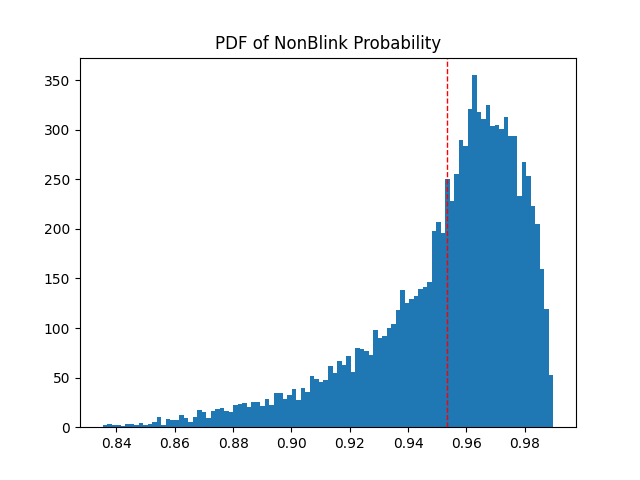
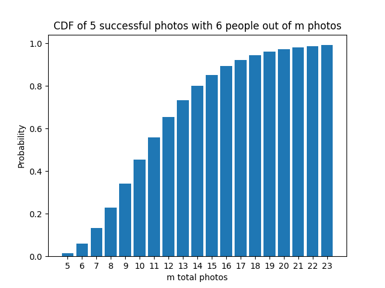

Friends get-togethers are fun and one of the only reasons that make life worth living, but you know the worst problem is? Taking photos afterwards. Seems like even with continuous camera zappings, there would be no one photo where everyone opens their eyes. My pal told me I should calculate the probability of taking a photo with all sets of eyes opened, so here I go!

## 1 Photo of 1 Person
Let’s establish 2 basic factoids:
- A single blink lasts 0.1 to 0.4 seconds. [1]
- The average interval between blinks (a single nonblink) is 2-10 seconds. [2]

Oh, and of course, we have to established some assumptions to simplify the problem (for now):
- The last blink or nonblink does not affect the timing of the next blink/nonblink. 
- The last photograph does not affect the timing of the next photograph.
- The person with the photo taken is an average human being, that does not have Blepharospasm that causes unusual blinking frequency (it’s a real thing, go search it up! I’ll try to be more inclusive for part 2 of this post maybe haha)

Consider a blink(**C**losed)-nonblink(**O**pen) cycle. Probability of picking any point in that duration that the person has their eyes opened should be:

$$
P(\text{open}) = \frac{\text{non_blink_duration}}{\text{cycle_duration}}
$$

Or more formally:
$$
P(\text{open}) = \frac{O}{O + C}
$$

Where O and C are random variables for duration of eyes-opened and eyes-closed, respectively:
- O ~ uniform(2-10): O is sampled from a uniform distribution between 2 and 10 seconds
- C ~ uniform(0.1-0.4): C is sampled from a uniform distribution between 0.1 and 0.4 seconds

For worst case and best case, you can just substitute O and C with the worst case and best case durations. For example, for the worst case: 2 seconds between blinks, with each blink lasting 0.4 seconds. So the worst-case probability of eyes opened should be:

$$
P(\text{open}) = \frac{2}{2 + 0.4} = 0.8(3)
$$

Therefore, for over a 60-second period, there would be 0.83*60 = 50 seconds where the eyes are opened, which means about 10 seconds where the eyes are closed!

But what we want for an estimate is the Expectation $E[P(open)]$. I can try to derive a closed-from solution, but I haven’t touched pen and paper ever since I started using the computer, so I'ma run Monte Carlo (MC) Sampling instead. When the probability distribution doesn’t have a close-form distribution or it’s hard to calculate, or its variables are high dimensional, MC Sampling is a good shortcut. With a few lines of code:

```python
def blink_uniform(
        sample_num: int = 10000,
        open_duration: tuple[float, float] = (2, 10),
        close_duration: tuple[float, float] = (0.1, 0.4)
        ):
    O = np.random.uniform(open_duration[0], open_duration[1], size= sample_num)
    C = np.random.uniform(close_duration[0], close_duration[1], size=sample_num)
   
    return O/(O + C)
```
We can then plot the PDF of NonBlink Probability:

<div style="display: flex; justify-content: center; gap: 10px;">
    
</div>
<p style="text-align: center; font-style: italic; margin-top: 10px;">Probability Density Function of Non-Blink Event</p>

**With the red line showing the Expectation of 0.9532, which means there are 95.32% chance that a random photo caught the person’s eyes open.**

In fact, it’s pretty hard to have your eyes closed in a random photo! By calculating the area under a segment of the histogram, for example `len(res[res > 0.9]) / len(res)` (`res` being the array output of `blink_uniform()`) you'd find that **about 94.19%** of the time, the probability of eyes-open is **greater than 90%**.

Just for the purpose of photo taking, we may even consider all the durations where eyelids are moving to transition between open and close are “un-photograph-able”. With a ballpark estimate, we consider that to add to close_duration 0.4 seconds. Calling `single_blink(open_duration= (1.6, 9.6), close_duration = (0.5, 0.9))`,
**we still have an 87% chance of getting a good photo!**

We have successfully found the true rate of eyes-opened for humans, and I have mathematically proven to my partner that her closing her eyes on me while I took her photo is… kinda on her, not me. I will be citing this everytime I got dissed for being a bad photographer.

## $m$ Photos of $n$ People
From there, we can extrapolate. Some the extra assumptions:
- One person blinking doesn’t affect other people blinking. Or there is no mutual effect that causes them to blink or not blink at the same time. They’re independent. Clean room get-together.
- No-one is intentionally trying their best to open eyes. These are random  capture-the-moment photos.
- Again all photos are independent trials.

There are 2 outcomes for each person, blink and nonblink, and 2 outcomes for each photo, successful (everyone nonblinking) or unsuccessful (at least 1 person blinking). So:
- Probability of 1 successful photo with n people in it: $P(open)^n$ (Vice versa for unsuccessful photo: $1-P(open)^n$)
- Probability of m successful photos with n people in it: $(P(open)^n)^m$
- Probability of m unsuccessful photos with n people in it: $(1 - P(open)^n)^m$
- Probability of m photos with n people in it, with at least 1 successful photo: $1 - (1-P(open)^n)^m$

So we’ve arrived at the statistics we want. Suppose there are 6 people in our get-together posing for a photo. We want a 99% chance of getting a good photo, so $$1-(1-0.87^6)^m > 0.99$$ Based on the true rate $P(open)$ found above, solving the inequality, we would get $m > 8.09$. **Therefore we would need 9 photos to get a pic to for sure, have at least 1 good photo of 6 people where everyone opens their eyes.**

## At least $k$ Successful Photos out of $m$ Photos of $n$ People 

With just using multiplication and complement rule, we have managed to calculate our guide for taking photos. But sometimes you want more than one photo, to compare and pick the best one! If you want say how many photos need to be taken such that there there are exactly $k$ successful photo, you can simply plug in the *Binomial Distribution* formula.

$$
P(X = k, m, p) = \binom{m}{k} p^k (1-p)^{m-k}
$$

Where $m$ is the number of trials, $k$ is the number of successes, and $p$ is the probability of success, everyone with their eyes open $P(open)^n$.

However, if you want to ensure **at least** $k$ successful photos with at least 99% probability, you actually need to calculate the cumulative probability:

$$
P(X \geq k) = 1 - P(X < k)> 0.99
$$

So in human language, what we know beforehand is $k$ and $n$. With $n$ = 6 people, and we want minimum $k$ = 5 good photos to choose from, what we need to know is, how many photos should we take to be sure that everyone open their eyes in at least 5 good photos? What we want to know is what is $m$?

We can use a few lines of python to iteratively increase the value of $m$ and use the complement of the cumulative distribution function `binom.cdf()` to calculate the probability of success for each $m$.

```python
from scipy.stats import binom

def blink_binom(
    p_open = 0.87, # True rate of eyes opened for 1
    n_people = 6,  # Total num of people
    k = 5, #At least 5 good photos
    confidence = 0.99, 
    max_num_img = 1000 #Gotta stop somewhere
):
    p_success = p_open ** n_people # Prob everyone's got their eyes open in 1 photo
    m = k
    probs = []
    while True:
        prob = 1 - binom.cdf(k-1, m, p_success) # cumulative distribution function
        probs.append(prob)
        if prob > confidence or m > max_num_img:
            break
        m += 1

    return probs
```

We can then plot the the probability of success for each $m$ values:

<div style="display: flex; justify-content: center; gap: 10px;">
    
</div>
<p style="text-align: center; font-style: italic; margin-top: 10px;">Probability of success for each m</p>

**We find that we would need 23 independent photos to get at least 5 good photos of 6 people, where everyone opens their eyes, at 99% confidence.**

However I imagine 23 consecutive photos is pretty tiring to take. So please, everyone, try to smile and keep that eyes open for the sake of the photographer! 

That’s the end of my work. Hopefully, it’s helped you dear readers refresh on your statistics knowledge, as much as it has helped me. If you find anywhere in the calculations that I got wrong, please feel free to let me know!


## REFERENCES
[1] Hersh, Erica. "How Many Times Do You Blink a Day — and Why?" Healthline, medically reviewed by Ann Marie Griff, O.D., 24 Sept. 2020, https://www.healthline.com/health/how-many-times-do-you-blink-a-day. Accessed 21 Apr. 2025.
 
[2] Bentivoglio, A. R.; Bressman, S. B.; Cassetta, E.; Carretta, D.; Tonali, P.; Albanese, A. (November 1997). "Analysis of blink rate patterns in normal subjects". Movement Disorders. 12 (6): 1028–1034. doi:10.1002/mds.870120629. ISSN 0885-3185. PMID 9399231. S2CID 12607655.